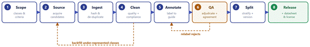
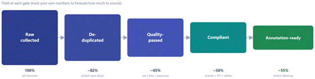
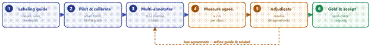

# Image Data Collection

Treat collection as a pipeline, not a one-off scrape. Define success criteria and a target count per class before acquiring anything, and attach provenance to every image from the moment it enters. The two feedback loops below keep the set balanced and the labels trustworthy.

## Step 1 — Scope before you collect

Before collecting images, define the dataset taxonomy and target number of images per class, including negative examples, to avoid class imbalance and uncontrolled scope expansion. Establish clear image quality requirements such as minimum resolution, aspect ratio, file format, lighting conditions, and viewpoint consistency, as these will serve as the quality threshold during later validation stages. Ensure adequate coverage and diversity across geographic regions, demographic groups, devices, seasons, and environmental conditions to improve model generalization and reduce bias. Finally, specify clear completion criteria, including target image counts and quality assurance thresholds, to determine when the data collection process is complete.

## Step 2 — Sourcing channels

Image data can be collected from multiple sources, each with different advantages, costs, and considerations. Public datasets such as COCO and Open Images provide large, often pre-labeled collections, though researchers must carefully review licensing terms and potential train-test leakage. Open web repositories, including Wikimedia Commons and Openverse, offer broad and low-cost data sources under licenses such as CC0 and CC-BY, but require attention to attribution requirements, duplicate content, and inappropriate material. Crowdsourcing enables rapid scaling and diverse data collection, though additional quality control and fraud detection mechanisms are necessary to ensure dataset reliability.

## Steps 3 — Ingest, de-duplicate & quality gates

Every candidate passes the same gates before labeling — apply them in this order.

- Integrity — open-able, non-corrupt, allowed format
- De-duplication — remove exact + near-dups via perceptual hash (pHash)
- Resolution & quality — minimum px met; reject blur / over- or under-exposed
- Compliance — license verified; PII / faces / plates handled; safety screen
- Provenance — log source, license, hash and dimensions (see F)

## Steps 4 — Annotation & quality assurance

- Write a labeling guide with examples and edge cases; pilot it before scaling.
- Overlap ≥2 annotators on a sample; measure agreement (κ / α) per class.
- Accept only when agreement clears the threshold and gold-set spot-checks pass.
- Low agreement → refine the guide and relabel, don’t just average disagreements away.

## Step 5: split, version & release

- Stratify splits by class and key attributes (geography, device).
- Prevent leakage: de-dupe across splits; keep same-source/scene images in one split.
- Freeze the test set; never tune on it.
- Version with semver + changelog; ship a datasheet (sources, licenses, known gaps).